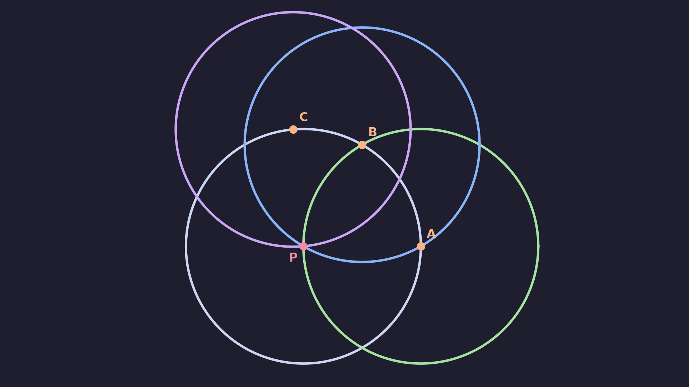
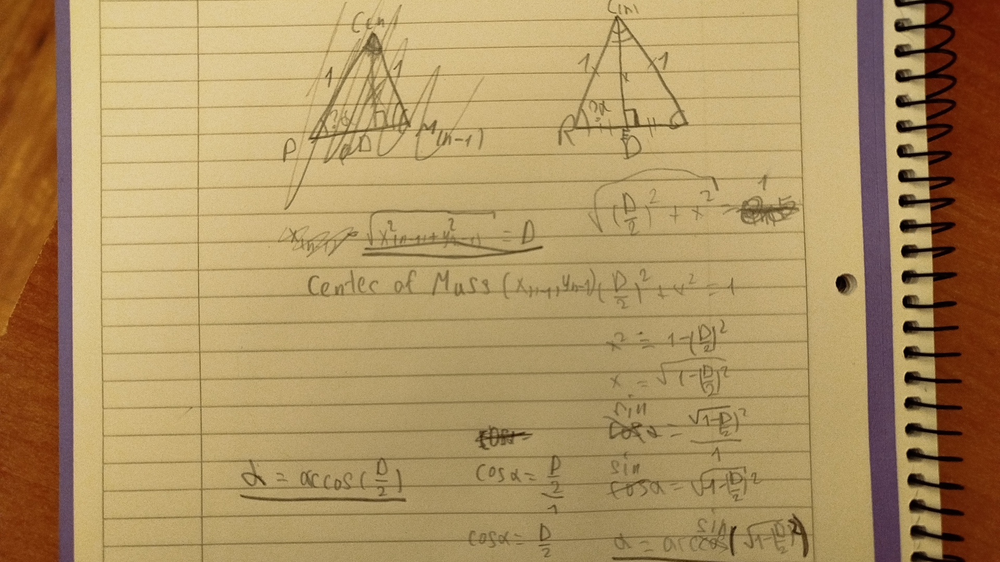

**Здоров!** Today, I had a sudden urge to solve a math problem, so I pulled up Project Euler and used a random number generator. It gave me problem #737. I opened it up, and this is what I saw:

***

> A game is played with many identical, round coins on a flat table.
>
> Consider a line perpendicular to the table.  
> The first coin is placed on the table touching the line.  
> Then, one by one, the coins are placed horizontally on top of the previous coin and touching the line.  
> The complete stack of coins must be balanced after every placement.
>
> The diagram below [not to scale] shows a possible placement of 8 coins where point $P$ represents the line.
>
>
>
> It is found that a minimum of 31 coins are needed to form a *coin loop* around the line, i.e., if in the projection of the coins on the table the center of the $n$-th coin is rotated $\theta_n$ about the line from the center of the $(n-1)$-th coin, then the sum $\sum_{k=2}^{n} \theta_k$ is first larger than $360^\circ$ when $n=31$. In general, to loop $k$ times, $n$ is the smallest number for which the sum is greater than $360^\circ \times k$.
>
> Also, 154 coins are needed to loop two times around the line, and 6947 coins to loop ten times.
>
> **Calculate the number of coins needed to loop 2020 times around the line.**

***

My first impression was "WTF," but then I read the question and saw that the coins need to be balanced. I remembered hearing about infinite stacking in a [Vsauce video](https://www.youtube.com/watch?v=pBYPXsGka74), so I went back and rewatched it. Okay, apparently I should use the harmonic sequence to solve this problem. 

However, the video described the "Tower of Lire" (the classic overhang stack), not a loop. I had the basic formula $\sum_{n=1}^{N}\frac{1}{2n}$, and I was trying to derive an equation to find at what length $N$ the sum approaches a given value $x$. This shouldn't be too bad.

Actually, wait... I don't know how to solve equations where the variable is the upper limit of a summation. I have $\sum_{n=1}^{N}\frac{1}{n} = 2x$. It seemed like at this point, I needed to learn more.

After watching a few videos on the topic, I realized that because a summation is discrete, we can use integration to approximate its value for fractional steps. The integral of $\frac{1}{n}$ yields the natural logarithm, $\ln(n)$. However, this continuous approach is not very accurate for small values of $n$. For instance, the exact sum of $\sum_{n=1}^{4}\frac{1}{2n}$ is approximately $1.041$, whereas the logarithmic approximation $\frac{1}{2}\ln(4)$ is only about $0.693$. To resolve this discrepancy, we must account for the inherent error between the discrete sum and its continuous approximation. This is where the Euler-Mascheroni constant ($\gamma \approx 0.57721$) comes into play, allowing us to bridge the gap:
$$\frac{\ln(4)+\gamma}{2} \approx 0.981$$

The error is still noticeable early on, but with larger numbers, it gets smaller and smaller.

<iframe src="https://www.desmos.com/calculator/qjwmu40d2w?embed" width="960" height="540" style={{ border: "1px solid #ccc" }} frameborder="0"></iframe>

So, let's return to the problem. We need to unwind the loop so that we can use the formula we derived. To do that, I need to know the length (in number of coins) of the loop, but I hit a wall and didn't actually know how to go further.

*(After staring at the problem for an hour)* I have a hunch that the angle of the coin's rotation might also be described harmonically, but I have no idea how to pack this into an equation. I'm taking a break. Honestly, I have no clue how to process this further right now. I will continue next Sunday.

*(After AI gave me a hint)* How could I have been so stupid? Why didn't I see it from the start? It's just the block-stacking problem wrapped in polar coordinates! It was a powerful "aha" moment. I couldn't wait until Sunday to verify this!

Okay, I had no idea how to combine all of this together, so I asked an AI for a hint. Also, I just found out that I am supposed to solve this using programming, and that most of these problems (including this one) don't have a simple, closed-form mathematical solution. Yeah, I completely missed reading that [About](https://projecteuler.net/about) section of the site.

The first hint was that the center of mass must be located on or inside the physical perimeter of the new coin. And because the coins have the exact same radius and must touch point $P$, the centers of all these coins must lie on the circumference of a circle that has the same radius as the coins, centered at point $P$.



This means I now needed to figure out a way to calculate the precise angle for each new coin so that the entire stack remains balanced.

*(After an hour or two of tinkering and staring at the problem page)* Okay, I still couldn't pack it together. I asked the AI for a third hint: *The center of mass of the previous circles must be exactly one radius away from the center of the current circle that I'm trying to place.*

Another powerful "aha" moment! It works because of a fundamental law of physics: for an object to remain balanced, its center of mass must be supported from underneath. For example, if you slide your fingers along a plank to find its center of mass, once you place a single finger directly beneath that point, the plank won't fall. To minimize the number of coins in this problem, I have to push that balance to its absolute physical limit, which means placing the new coin so that the previous center of mass sits exactly on its circumference.

At this point, something clicked, and I realized I could use a triangle to figure out the angle. I just didn’t know exactly how yet. So, I pulled out my notebook and started tinkering with the math.



Of course, midway through, I confused sine and cosine, but I still managed to find the equation to calculate the angle. Since that only gave me the relative angle, I realized I also needed to calculate the center of mass angle which, thankfully, is just a simple `atan2` function. From there, I quickly wrote up some Python code.

```python
from math import sin, cos, acos, pi, sqrt, atan2
import time

def solution(loops: int) -> int:
    angle = pi / 2
    coins = 1
    sum_x = 0
    sum_y = 1
    total_angle = 0
    while total_angle <= 2 * pi * loops:
        cm_x = sum_x / coins
        cm_y = sum_y / coins
        d = sqrt(cm_x**2 + cm_y**2)

        # 1. Calculate the angle of the Center of Mass vector
        alpha_cm = atan2(cm_y, cm_x)

        alpha_offset = acos(d / 2)
        next_coin_angle = alpha_cm + alpha_offset

        # 4. Track how much the coin angle actually advanced from the last one
        # Use a directional angular difference
        angle_diff = next_coin_angle - angle

        # Normalize the difference to ensure it handles boundary wrapping correctly
        angle_diff = (angle_diff + pi) % (2 * pi) - pi

        total_angle += abs(angle_diff)

        # 5. Update state for the next iteration
        sum_x += cos(next_coin_angle)
        sum_y += sin(next_coin_angle)
        angle = next_coin_angle
        coins += 1
    return coins

def main():
    LOOPS = 2020

    # Record the start time
    start_time = time.perf_counter()

    coins = solution(LOOPS)

    # Record the end time
    end_time = time.perf_counter()

    print("Result:", coins)

    # Calculate and display the duration
    execution_time = end_time - start_time
    print(f"Execution time: {execution_time:.6f} seconds")

if __name__ == "__main__":
    main()

```

---

**Output:**

```text
Result: 757794899
Execution time: 249.863372 seconds

```

Okay, the problem was solved, but I wasn't satisfied with the execution time. So, like a true Rust developer, I rewrote it in Rust.

```rust
use std::f64::consts::{FRAC_PI_2, PI, TAU};

pub fn solution(loops: usize) -> usize {
    let mut angle: f64 = FRAC_PI_2;
    let mut coins: f64 = 1.0;
    let mut sum_x: f64 = 0.0;
    let mut sum_y: f64 = 1.0;
    let mut total_angle: f64 = 0.0;

    while total_angle <= TAU * (loops as f64) {
        let cm_x = sum_x / coins;
        let cm_y = sum_y / coins;
        let cm_angle = cm_y.atan2(cm_x);
        let d = (cm_x.powi(2) + cm_y.powi(2)).sqrt();
        let angle_offset = (d / 2.0).acos();

        let next_coin_angle = cm_angle + angle_offset;

        let angle_diff = (next_coin_angle - angle + PI).rem_euclid(2.0 * PI) - PI;

        total_angle += angle_diff.abs();

        sum_x += next_coin_angle.cos();
        sum_y += next_coin_angle.sin();
        angle = next_coin_angle;

        coins += 1.0;
    }
    coins as usize
}

```

---

**Output:**

```text
Result: 757794899
Execution time: 29.003051904s

```

Okay, that's far better. I'm pretty sure there is plenty of room for further optimization, but I decided to stop because nobody—myself included—actually gives a shit about the execution time of a fun math problem once it passes.

To conclude: I accidentally calculated the sum of a harmonic sequence that I didn't even need, got three hints from an AI, and finally got this thing working. I should definitely try this again later.

Bye-bye!
